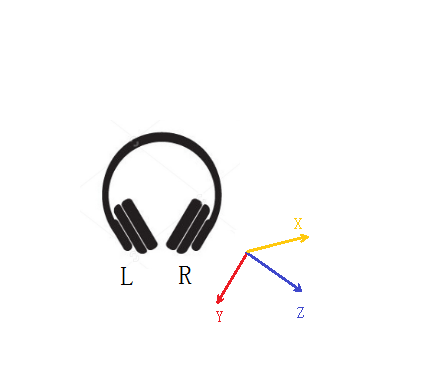
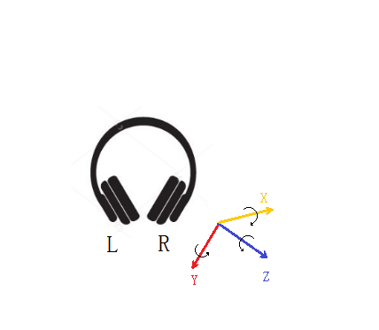

Everest SDK API
=========================================

Class Bluetooth
------------------

This class start bluetooth connect to JBL headphone, and has a interface to get results.

Connect
++++++++++++++++++++++
connect handphone to JBL headphone with Bluetooth.

**Signature:**

public void connect(BluetoothDevice device) throws IOException

**Parameter:**

BluetoothDevice device – bluetooth device

**Returns:**

void

disconnect
++++++++++++++++++++++
disconnect handphone to JBL headphone .

**Signature:**

public synchronized void disconnect(BluetoothDevice device)

**Parameter:**

BluetoothDevice device – bluetooth device 

**Returns:**

void

discoverBluetoothDevices
++++++++++++++++++++++++++
start discovering to find Bluetooth Device.

**Signature:**

public void discoverBluetoothDevices()

**Parameter:**

void

**Returns:**

void

start
++++++++++++++++++++++
enable bluetooth adapter, register bluetooth action handler.

**Signature:**

public synchronized void start()

**Parameter:**

void

**Returns:**

void

isDiscovering
++++++++++++++++++++++
judge if bluetootch adpter is discovering

**Signature:**

public boolean isDiscovering()

**Parameter:**

void

**Returns:**

true – in discovering

false – not discovering

cancelDiscovery
++++++++++++++++++++++
cancle bluetooth adapter discovering.

**Signature:**

public void cancelDiscovery() 

**Parameter:**

void

**Returns:**

void

deviceName
++++++++++++++++++++++
get bluetooth device name.

**Signature:**

public String deviceName(BluetoothDevice device)

**Parameter:**

void

**Returns:**

String – bluetooth name

public interface BluetoothListener
--------------------------------------
 
bluetoothAdapterChangedState
+++++++++++++++++++++++++++++++++
notify app if bluetooth state changed

**Signature:**

    void bluetoothAdapterChangedState(Bluetooth bluetooth, int currentStat, int previousStat)

**Parameter:**

	bluetooth – Bluetooth instance
	
 	currentStat – current state
 	
	previousStat – previous state
	

**Returns:**

void

bluetoothDeviceBondStateChanged
++++++++++++++++++++++++++++++++++++
notify bond state changed.As demo code has shown, needn't call connect function, the low level code will connect.  

**Signature:**

    void bluetoothDeviceBondStateChanged(Bluetooth bluetooth, BluetoothDevice device, int currentStat, int previousStat);
    
**Parameter:**

	bluetooth – Bluetooth instance
	
	device – Bluetooth Device 
	
 	currentStat – current state
 	
	previousStat – previous state

**Returns:**

void
	
bluetoothDeviceConnected
+++++++++++++++++++++++++++++++++
notify bluetooch device is connected. It's most important callback function.
From it get bluetooth socket, then we could get HeadPhoneCtrl handler.

**Signature:**

    void bluetoothDeviceConnected(Bluetooth bluetooth, BluetoothDevice device, BluetoothSocket socket)

**Parameter:**

	bluetooth – Bluetooth instance
	
	device – Bluetooth device
	
 	socket – Bluetooth Socket 
 	

**Returns:**

void

bluetoothDeviceDisconnected
++++++++++++++++++++++++++++++++++
notify bluetooch device is disconnected

**Signature:**

    void bluetoothDeviceDisconnected(Bluetooth bluetooth, BluetoothDevice device)

**Parameter:**

	bluetooth – Bluetooth instance
	
	device – Bluetooth device

**Returns:**

void

bluetoothDeviceDiscovered
++++++++++++++++++++++++++++++++++
notify bluetooch device is discovered

**Signature:**

    void bluetoothDeviceDiscovered(Bluetooth bluetooth, BluetoothDevice device)

**Parameter:**

	bluetooth – Bluetooth instance
	
	device – Bluetooth device

**Returns:**

void

bluetoothDeviceFailedToConnect
++++++++++++++++++++++++++++++++++++
notify bluetooch device failed to connect

**Signature:**

    void bluetoothDeviceFailedToConnect(Bluetooth bluetooth, BluetoothDevice device, Exception exception)

**Parameter:**

	bluetooth – Bluetooth instance
	
	device – Bluetooth device
	
	exception – Exception 

**Returns:**

void

bluetoothDeviceFailedToConnect
++++++++++++++++++++++++++++++++++++++++++++
notify bluetooch device failed to connect

**Signature:**

    void bluetoothDeviceFailedToConnect(Bluetooth bluetooth, BluetoothDevice device, Exception exception)

**Parameter:**

	bluetooth – Bluetooth instance
	
	device – Bluetooth device
	
	exception – Exception 

**Returns:**

void

Class HeadPhoneCtrl
--------------------------------------
Control Headphone and get asynchronized result by callback function. It contains ANCCtrl, EQSettingCtrl, CalibrateControl and CommonControl. Corresponding to those controls the interfaces are ANCCtrlListner EQSettingListener CalibrateListener CommonListner.

getInstance
++++++++++++++++++++++
get singleton of HeadPhoneCtrl

**Signature:**

public synchronized static HeadPhoneCtrl getInstance(Activity activity, BluetoothSocket bluetoothSocket)

**Parameter:**

	activity – android activity
	
	bluetoothSocket – socket of bluetooth

**Returns:**

instance of HeadPhoneCtrl

close
++++++++++++++++++++++
close this control

**Signature:**

public void close()

**Parameter:**

void
	
**Returns:**

void

resetHeadPhoneCtrl
++++++++++++++++++++++
reset headphone control by new bluetooth socket

**Signature:**

public void resetHeadPhoneCtrl(BluetoothSocket bluetoothSocket)

**Parameter:**

	bluetoothSocket – socket of bluetooth

**Returns:**

void

setANCListner
++++++++++++++++++++++
set ANC listener

**Signature:**

public void setAncListner(ANCCtrlListner ancListner)

**Parameter:**

ancListner – ANC listener

**Returns:**

void

setEqListner
++++++++++++++++++++++
set EQ Setting listener

**Signature:**

public void setEqListner(EQSettingListner eqListner)

**Parameter:**

eqListner – EQ Setting listener

**Returns:**

void

setCaliListener
++++++++++++++++++++++
set Calibrate listener

**Signature:**

public void setCaliListener(CalibrateListener caliListener)

**Parameter:**

caliListener – Calibrate listener

**Returns:**

void

setCommonListner
++++++++++++++++++++++
set Common listener

**Signature:**

public void setCommonListner(CommonListner commonListner)

**Parameter:**

commonListner – Common listener

**Returns:**

void

class ANCCtrl
--------------------------------------
Control Of Awareness.

switchANC
++++++++++++++++++++++
get singleton of HeadPhoneCtrl

**Signature:**

public void switchANC(boolean onOff)

**Parameter:**

	onOff – switch ANC on/off

**Returns:**

void

getANCEnable
++++++++++++++++++++++
get ANC state: enable or not

**Signature:**

public void getANCEnable()

**Parameter:**

void
	
**Returns:**

void

getANCAwarenessPreset
++++++++++++++++++++++
get ANC Awareness Preset mode:none low medium high.

**Signature:**

public void getANCAwarenessPreset()

**Parameter:**

void
	
**Returns:**

void

setANCAwarenessPreset
++++++++++++++++++++++
set ANC Awareness Preset mode:none low medium high.

**Signature:**

public void setANCAwarenessPreset(ANCAwarenessPreset preset)

**Parameter:**

	 preset – preset mode.

**Returns:**

void

setLeftAwarenessPresetValue
++++++++++++++++++++++++++++++++++
set left Awareness value.

**Signature:**

public void setLeftAwarenessPresetValue(int leftANCvalue)

**Parameter:**

	 leftANCvalue – left Awareness value

**Returns:**

void

setRightAwarenessPresetValue
+++++++++++++++++++++++++++++++++
set right Awareness value.

**Signature:**

public void setRightAwarenessPresetValue(int rightANCvalue)

**Parameter:**

	 rightANCvalue – right Awareness value

**Returns:**

void

getLeftANCvalue
++++++++++++++++++++++
get left Awareness value.

**Signature:**

public void getLeftANCvalue()

**Parameter:**

void

**Returns:**

void

getRightANCvalue
++++++++++++++++++++++
get right Awareness value.

**Signature:**

public void getRightANCvalue()

**Parameter:**

void

**Returns:**

void

getBatteryLevel
++++++++++++++++++++++
get battery level.

**Signature:**

public void getBatteryLevel()

**Parameter:**

void

**Returns:**

void

class EQSettingCtrl
--------------------------------------
Control Of EQ Setting.

getCurrentPreset
++++++++++++++++++++++
get current EQ preset mode.

**Signature:**

public void getCurrentPreset()

**Parameter:**

void

**Returns:**

void

applyPresetWithoutBand
+++++++++++++++++++++++++++
get EQ preset mode without band.

**Signature:**

public void applyPresetWithoutBand(GraphicEQPreset presetType)

**Parameter:**

presetType – 4 types: Off Jazz Vocal Bass 

**Returns:**

void

applyPresetWithBand
++++++++++++++++++++++
get EQ preset mode with band.

**Signature:**

public void applyPresetWithBand(GraphicEQPreset preset, int[] values)

**Parameter:**

preset –  4 types: Off Jazz Vocal Bass

values –  band value array, including low 3, medium 4, high 3

**Returns:**

void

getAllGraphicEQValues
++++++++++++++++++++++
get all graphic EQ preset valuse.

**Signature:**

public void getAllGraphicEQValues( GraphicEQPreset preset)

**Parameter:**

preset –  graphic EQ preset mode

**Returns:**

void

class CalibrateCtrl
--------------------------------------
Control Of Calibrate.

startCalibration
++++++++++++++++++++++
start auto Calibrate.

**Signature:**

public void startCalibration()

**Parameter:**

void

**Returns:**

void

stopCalibration
++++++++++++++++++++++
stop Calibrate.

**Signature:**

public void stopCalibration()

**Parameter:**

void

**Returns:**

void

getCalibrationStatus
++++++++++++++++++++++
get Calibrate status.

**Signature:**

public void getCalibrationStatus()

**Parameter:**

void

**Returns:**

void

class CommonCtrl
--------------------------------------
Control Of Common(always in setting page of UI).

getProgrammableIndexButton
+++++++++++++++++++++++++++++++++++
get Programmable index Button.

**Signature:**

public void getProgrammableIndexButton()

**Parameter:**

void

**Returns:**

void

setProgrammableIndexButton
++++++++++++++++++++++++++++++++++++
set Programmable index Button.

**Signature:**

public void setProgrammableIndexButton(int idx)

**Parameter:**

int idx – 0x00: Ambient Awareness Toggle

		0x01: ANC Enable/Disable
		
		0x03: Custom Event 

**Returns:**

void

set9AxisSensorStatus
++++++++++++++++++++++++++++++
Used to set sensor is Enabled/Disabled.

**Signature:**

public void set9AxisSensorStatus(boolean enable)

**Parameter:**

boolean enable – true: enable push the 9 axis sensor data, false: disable push the 9 axis sensor data

**Returns:**

void

set9AxisPushFrequency
++++++++++++++++++++++++++++++
Used to change the push interval time.

**Signature:**

public void set9AxisPushFrequency(int frequency)

**Parameter:**

int frequency – Default: 200ms. Cannot be set to any value smaller than 200ms

**Returns:**

void

get9AxisSensorStatus
+++++++++++++++++++++++++++++
Used to get sensor is Enabled/Disabled.

**Signature:**

public void get9AxisSensorStatus()

**Parameter:**

void

**Returns:**

void

get9AxisPushFrequency
++++++++++++++++++++++++++++++
Used to get the push interval time.

**Signature:**

public void get9AxisPushFrequency()

**Parameter:**

void

**Returns:**

void

get9AxisRawData
+++++++++++++++++++++++++++++++++
Used to get the raw data.

**Signature:**

public void get9AxisRawData()

**Parameter:**

void

**Returns:**

void

getConfigModelNumber
++++++++++++++++++++++
get config mode number.

**Signature:**
public void getConfigModelNumber()

**Parameter:**

**Returns:**
void

getConfigProductName
++++++++++++++++++++++
get config product name.

**Signature:**
public void getConfigProductName()

**Parameter:**

**Returns:**
void

getAutoOffFeature
++++++++++++++++++++++
get auto off feature

**Signature:**
public void getAutoOffFeature()

**Parameter:**

**Returns:**
void

setAutoOffFeature
++++++++++++++++++++++
set auto off feature

**Signature:**

public void setAutoOffFeature(boolean autoOff)

**Parameter:**

autoOff – true: auto off, false: not auto off

**Returns:**

void

getEnableVoicePrompt
++++++++++++++++++++++
get enable voice promt switch status

**Signature:**

public void getEnableVoicePrompt()

**Parameter:**

void

**Returns:**

void

setEnableVoicePrompt
++++++++++++++++++++++
set enable voice promt switch status

**Signature:**

public void setEnableVoicePrompt(boolean voiceprompt)

**Parameter:**

voiceprompt – voice promot switch on/off

**Returns:**

void

getFirmwareVersion
++++++++++++++++++++++
get firmware version

**Signature:**

public void getFirmwareVersion()

**Parameter:**

void

**Returns:**

void

public interface ANCCtrlListner
--------------------------------------
If we call the APIs above and need get result from HeadPhone, register listeners as below.

getANCSwitchStateReply
++++++++++++++++++++++++++
get Awareness switch status Reply.

**Signature:**

public void getANCSwitchStateReply(boolean onOff)

**Parameter:**

onOff – switch status

**Returns:**

void

getANCAwarenessPresetReply
++++++++++++++++++++++++++++++++
get Awareness Preset reply.

**Signature:**

public void getANCAwarenessPresetReply(ANCAwarenessPreset preset)

**Parameter:**

preset – ANCAwareness Preset

**Returns:**

void

getLeftANCValueReply
++++++++++++++++++++++
get left Awareness value Reply.

**Signature:**

public void getLeftANCValueReply(long leftVal)

**Parameter:**

leftVal – left Awareness value

**Returns:**

void

getRightANCValueReply
++++++++++++++++++++++
get right Awareness value Reply.

**Signature:**

public void getRightANCValueReply(long rightVal)

**Parameter:**

rightVal – right Awareness value

**Returns:**

void

getBatteryLevelReply
++++++++++++++++++++++
get headphone battery level Reply.

**Signature:**

public void getBatteryLevelReply(long level)

**Parameter:**

level – battery level value

**Returns:**

void

public interface  EQSettingListner
--------------------------------------

getCurrentPresetReply
++++++++++++++++++++++
get current EQ preset mode Reply.

**Signature:**

public void getCurrentPresetReply(String eqName, int index)

**Parameter:**

eqName – EQ name: off, Jazz, Vocal, Bass, User

index – EQ index

**Returns:**

void

getCurrentPresetReply
++++++++++++++++++++++
get current EQ preset mode Reply.

**Signature:**

public void getEQSettingParamReply(int preset, int numOfBand, long values[])

**Parameter:**

preset – preset mode

numOfBand – number of bands

values – value array， from high(16kHz, 8kHz, 4kHz), medium(2kHz, 1kHz, 500Hz, 250Hz) to low(125Hz, 64Hz, 32Hz)

**Returns:**

void

getEQMinMaxParam
++++++++++++++++++++++
get current EQ preset mode Reply.

**Signature:**

public void getEQMinMaxParam(int limitNumBands, int limitNumSettings, int limitMin, int limitMax)

**Parameter:**

limitNumBands – limit number of bands

limitNumSettings – limit  number of settings   

limitMin – EQ minium value

limitMax – EQ maxium value

**Returns:**

void

public interface CalibrateListener
--------------------------------------

calibrationCompleteReply
+++++++++++++++++++++++++++++++
Calibrate complete result.

**Signature:**

public void calibrationCompleteReply(boolean success)

**Parameter:**

success – if success it's true, otherwise false

**Returns:**

void

public interface CommonListner
--------------------------------------

getProgrammableIndexButtonReply
++++++++++++++++++++++++++++++++++++
get Programmable index Button Reply.

**Signature:**

public void getProgrammableIndexButtonReply(int idx)

**Parameter:**

int idx – 0x00: Ambient Awareness Toggle

		0x01: ANC Enable/Disable
		
		0x03: Custom Event 

**Returns:**

void

getConfigModelNumberReply
++++++++++++++++++++++++++++++++
get config mode number Reply.

**Signature:**
public void getConfigModelNumberReply(String modelNum)

**Parameter:**
modelNum – config model number

**Returns:**

void

getConfigProductNameReply
+++++++++++++++++++++++++++++
get config product name Reply.

**Signature:**

public void getConfigProductNameReply(String prodName)

**Parameter:**

prodName – config product name

**Returns:**

void

getAutoOffFeatureReply
+++++++++++++++++++++++++
get auto off feature Reply.

**Signature:**

public void getAutoOffFeatureReply(boolean autoOff)

**Parameter:**
autoOff – auto off or not

**Returns:**

void

getEnableVoicePromptReply
+++++++++++++++++++++++++++++++++
get enable voice prompt Reply.

**Signature:**
public void getEnableVoicePromptReply(boolean prompt)

**Parameter:**
prompt – prompt voice switch on/off

**Returns:**

getFirmwareVersionReply
+++++++++++++++++++++++++++
get firmware version Reply.

**Signature:**
public void getFirmwareVersionReply(int version, int minor, int major)

**Parameter:**

version – firmware version

minor – minor version

major – major version

**Returns:**
    
waitCommandReplyElapsedTime
+++++++++++++++++++++++++++++++++++
wait command reply elpased time.

**Signature:**

public void waitCommandReplyElapsedTime(int elapaseMs)

**Parameter:**

elapaseMs –  elpased time in ms

**Returns:**

setAutoOffFeatureReply
+++++++++++++++++++++++++
set auto off feature Reply.

**Signature:**

public void setAutoOffFeatureReply(boolean success)

**Parameter:**

success –  set success or not

**Returns:**

headphoneError
++++++++++++++++++++++
headphone error Reply.

**Signature:**

public void headPhoneError(Exception exception)

**Parameter:**

exception – exception content

**Returns:**

setEnableVoicePromptReply
+++++++++++++++++++++++++++++
set enable voice prompt Reply

**Signature:**

public void setEnableVoicePromptReply(boolean success)

**Parameter:**

success – set success or not

**Returns:**

getCustomButtonReply
++++++++++++++++++++++++++++
the reply that after customizing the smart button to do custom event, if user presses the smart button.

**Signature:**

public void getCustomButtonReply()

**Parameter:**

void

**Returns:**

void

get9AxisRawDataReply
++++++++++++++++++++++
the push data of 9 axis sensor data

**Signature:**

public void get9AxisRawDataReply(double accelX,double accelY,double accelZ,double gyroX,double gyroY,double gyroZ,double magnetoX,double magnetoY,double magnetoZ)

**Parameter:**

double accelX - Accelerometer x value. The unit of accelerometer is ​m/s2

double accelY - Accelerometer y value. The unit of accelerometer is ​m/s2

double accelZ - Accelerometer z value. The unit of accelerometer is ​m/s2

double gyroX - The Gryometer x value. The unit of gryometer is rad/s

double gyroY - The Gryometer y value. The unit of gryometer is rad/s

double gyroZ - The Gryometer z value. The unit of gryometer is rad/s

double magnetoX - Magnetometer x value. The unit of magnetometer is uT

double magnetoY - Magnetometer y value. The unit of magnetometer is uT

double magnetoZ - Magnetometer z value. The unit of magnetometer is uT

**Returns:**

void

**Note**

The xyz axis of accelerometer as below, and the archor point is in the right earphone:

.. _fig_1:

The xyz axis of gryometer as below, and the archor point is in the right earphone, The black arrows show the positive direction:

.. _fig_2:

get9AxisSensorStatusReply
+++++++++++++++++++++++++++++++++
the reply of get9AxisSensorStatus

**Signature:**

public void get9AxisSensorStatusReply(boolean enable)

**Parameter:**

boolean enable - the sensor is Enabled/Disabled

**Returns:**

void

get9AxisPushFrequencyReply
++++++++++++++++++++++++++++++
the reply of get9AxisPushFrequency

**Signature:**

public void get9AxisPushFrequencyReply(int frequency)

**Parameter:**

int frequency – the frequency of 9 axis sensor data

**Returns:**

void

set9AxisSensorStatusReply
++++++++++++++++++++++++++++++
the reply of set9AxisPushFrequency

**Signature:**

public void set9AxisSensorStatusReply(boolean success)

**Parameter:**

boolean success – set success or not

**Returns:**

void

set9AxisPushFrequencyReply
++++++++++++++++++++++++++++++
the reply of set9AxisPushFrequency

**Signature:**

public void set9AxisPushFrequencyReply(boolean success)

**Parameter:**

boolean success – set success or not

**Returns:**

void